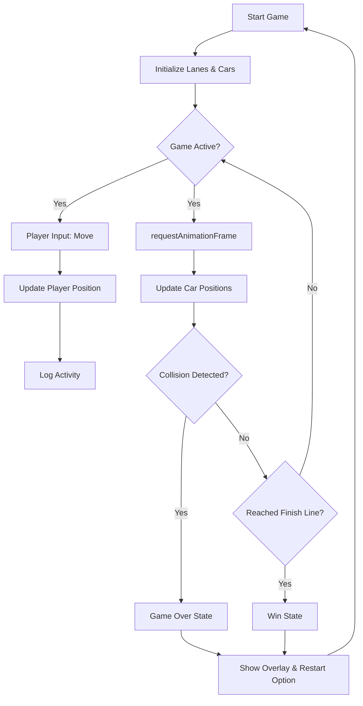

# Crossyfluffle 🐰

A fast-paced "Crossy Road" style arcade game built with React 19 and Vite.

## 🚀 Quick Start

```bash
pnpm install
pnpm dev
```

## 🎮 How to Play

- **Desktop**: Move Fluffle using **Arrow Keys**.
- **Mobile**: Use the on-screen **D-Pad**.
- **Goal**: Cross busy roads and reach the final grass lane safely.

## 🔄 Game Flow Diagram


